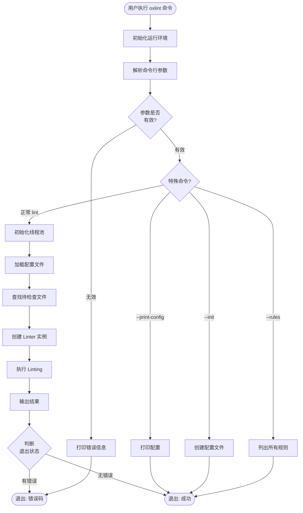
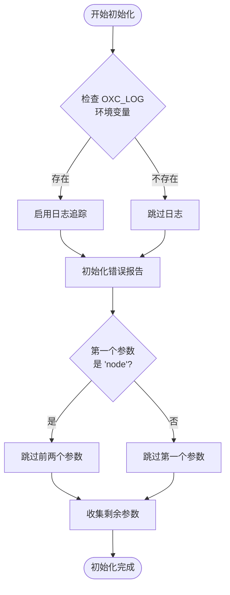
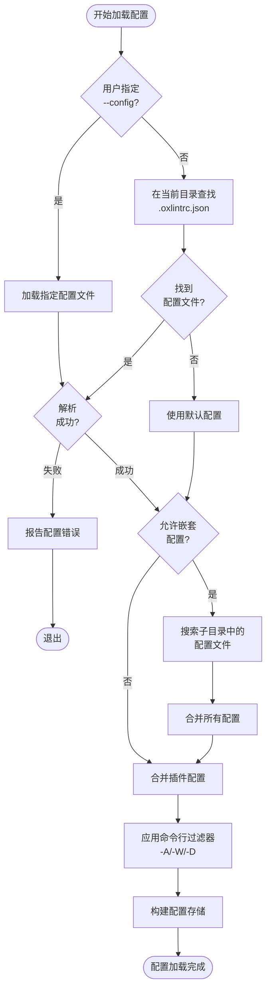
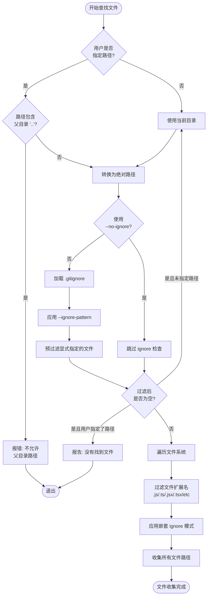
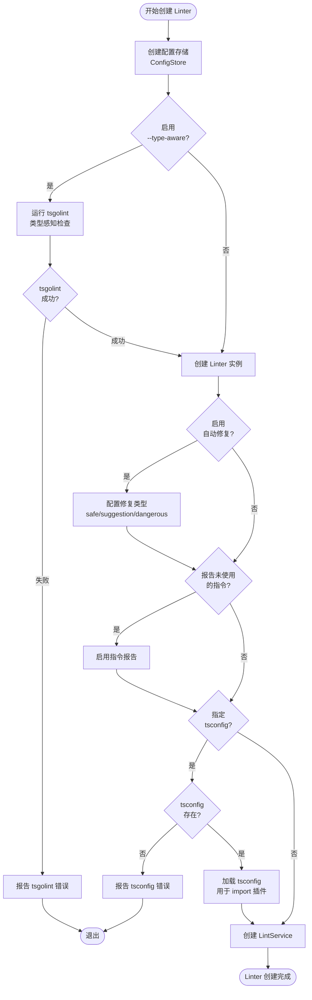
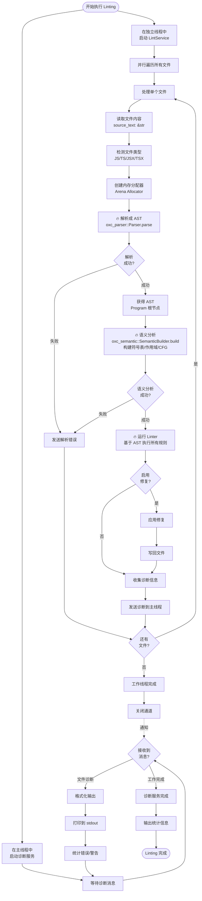
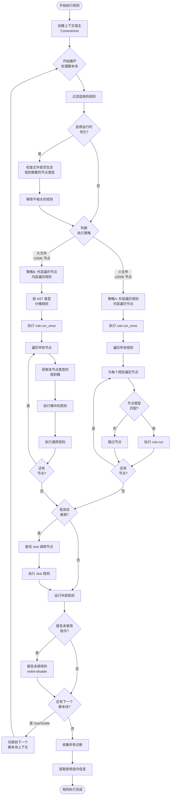
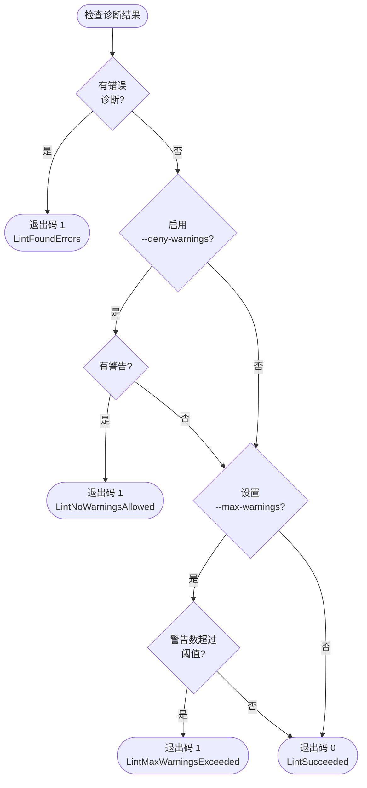
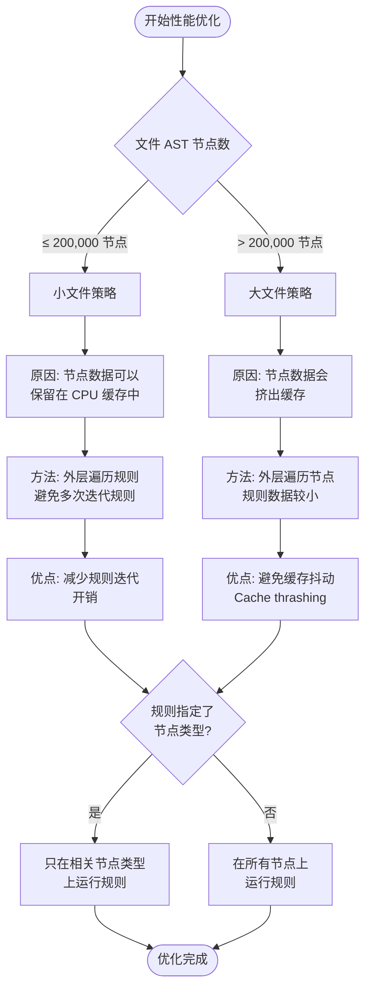
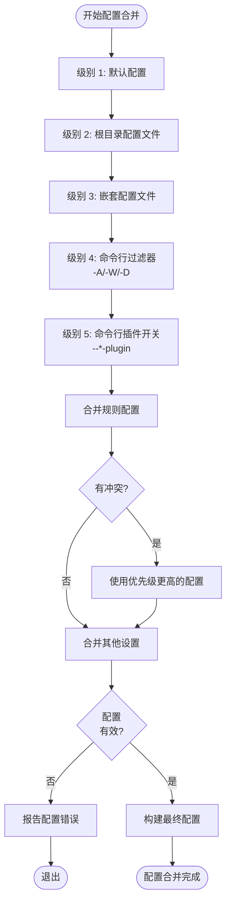

# Oxlint 逻辑流程图

## 1. 总体启动流程



---

## 2. 初始化运行环境详细流程



---

## 3. 配置文件加载流程



---

## 4. 文件查找和过滤流程



---

## 5. Linter 创建和配置流程



---

## 6. Linting 执行流程（并发）



---

## 7. 单个文件的规则执行流程



---

## 8. 退出状态判断流程



---

## 9. 性能优化决策流程



---

## 10. 配置合并优先级流程



---

## ❗必须的处理步骤

**每个文件都必须经过以下步骤，不能跳过**：

```
1. 读取文件内容 (source_text)
   ↓
2. 🔥 解析成 AST (oxc_parser)
   ↓
3. 🔥 语义分析 (oxc_semantic)
   ↓
4. 🔥 执行 Lint 规则 (基于 AST 节点)
   ↓
5. 输出诊断或应用修复
```

**为什么必须要 AST？**

- Lint 规则需要理解代码结构
- 需要区分不同类型的节点（变量声明、函数、表达式等）
- 需要访问语义信息（作用域、符号表、引用关系）
- 字符串匹配无法准确检测代码问题

---

## 关键逻辑决策点总结

| 决策点          | 选项                     | 影响                     |
| --------------- | ------------------------ | ------------------------ |
| **文件大小**    | ≤200K 节点 vs >200K 节点 | 决定迭代策略（缓存优化） |
| **类型感知**    | 启用 vs 禁用             | 是否运行 tsgolint        |
| **自动修复**    | 启用 vs 禁用             | 是否写回文件             |
| **嵌套配置**    | 启用 vs 禁用             | 是否搜索子目录配置       |
| **输出格式**    | default/json/junit/等    | 决定诊断输出格式         |
| **警告处理**    | deny/max-warnings        | 影响退出码               |
| **并发策略**    | 线程数                   | 影响处理速度             |
| **ignore 模式** | 启用 vs --no-ignore      | 决定文件过滤行为         |

---

## 并发模型

```mermaid
graph TB
    subgraph 主线程
        A[解析参数] --> B[加载配置]
        B --> C[查找文件]
        C --> D[创建 Linter]
        D --> E[启动诊断服务]
        E --> F[等待并输出诊断]
        F --> G[输出统计信息]
    end

    subgraph Rayon 线程池
        H[并行处理文件 1]
        I[并行处理文件 2]
        J[并行处理文件 N]
    end

    D -.启动.-> H
    D -.启动.-> I
    D -.启动.-> J

    H -.诊断消息.-> F
    I -.诊断消息.-> F
    J -.诊断消息.-> F

    style 主线程 fill:#e1f5ff
    style Rayon 线程池 fill:#fff4e1
```

这个逻辑流程图展示了 Oxlint 的核心决策点和执行路径，帮助理解其设计思想和优化策略。
