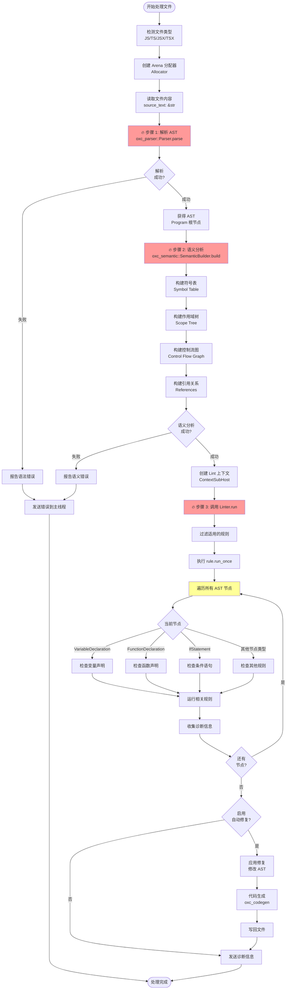

# 单个文件的完整处理流程

## ❗重要说明

**Oxlint 不是直接读取文件就能检查的！** 必须经过以下完整流程：

```
读取文件 → 解析成 AST → 语义分析 → 执行 Lint 规则 → 输出诊断
```

---

## 🔥 完整处理流程

### 阶段 1: 读取文件内容

**位置**: `crates/oxc_linter/src/service/runtime.rs:341`

```rust
// 读取文件到 arena 内存分配器中
let file_result = self.file_system.read_to_arena_str(path, allocator)
```

**输出**:

- `source_text: &str` - 文件的原始文本内容
- `source_type: SourceType` - 文件类型（JS/TS/JSX/TSX 等）

---

### 阶段 2: 🔥 解析成 AST（Abstract Syntax Tree）

**位置**: `crates/oxc_linter/src/service/runtime.rs:966-972`

```rust
// 使用 oxc_parser 将源代码解析成 AST
let ret = Parser::new(allocator, source_text, source_type)
    .with_options(ParseOptions {
        parse_regular_expression: true,        // 解析正则表达式
        allow_return_outside_function: true,   // 允许函数外的 return
        ..ParseOptions::default()
    })
    .parse();  // 🔥 这里执行解析！

// 检查解析错误
if !ret.errors.is_empty() {
    return Err(ret.errors);  // 有语法错误，直接返回
}
```

**关键点**:

- 使用 **oxc_parser** crate 进行解析
- 将源代码字符串转换为 **AST 数据结构**
- AST 包含程序的完整结构信息（表达式、语句、声明等）
- 如果有语法错误，直接报错，不继续处理

**输出**:

- `ret.program: Program` - AST 根节点
- `ret.errors` - 解析错误列表
- `ret.module_record` - 模块导入导出信息

---

### 阶段 3: 🔥 语义分析（Semantic Analysis）

**位置**: `crates/oxc_linter/src/service/runtime.rs:978-990`

```rust
// 使用 oxc_semantic 进行语义分析
let semantic_ret = SemanticBuilder::new()
    .with_cfg(true)                      // 构建控制流图 (Control Flow Graph)
    .with_scope_tree_child_ids(true)     // 构建作用域树
    .with_build_jsdoc(true)              // 解析 JSDoc 注释
    .with_check_syntax_error(check_syntax_errors)
    .build(allocator.alloc(ret.program)); // 🔥 这里执行语义分析！

// 检查语义错误
if !semantic_ret.errors.is_empty() {
    return Err(semantic_ret.errors);
}

let mut semantic = semantic_ret.semantic;
semantic.set_irregular_whitespaces(ret.irregular_whitespaces);
```

**关键点**:

- 使用 **oxc_semantic** crate 进行语义分析
- 在 AST 的基础上构建更多信息：
  - **符号表** (Symbol Table) - 变量、函数的定义和引用
  - **作用域树** (Scope Tree) - 嵌套的作用域关系
  - **控制流图** (CFG) - 程序执行流
  - **类型信息** (Type Info) - TypeScript 类型（如果是 TS）
  - **引用关系** - 变量的读写关系

**输出**:

- `semantic: Semantic` - 包含所有语义信息的结构

---

### 阶段 4: 准备 Lint 上下文

**位置**: `crates/oxc_linter/src/service/runtime.rs:600-650`

```rust
// 为每个脚本块创建上下文
let context_sub_hosts: Vec<ContextSubHost> = section_module_records
    .into_iter()
    .zip(dep.section_contents)
    .map(|(module_record, content)| {
        ContextSubHost::new(
            Arc::clone(module_record),
            content.semantic,  // 传入语义分析结果
        )
    })
    .collect();
```

**关键点**:

- 将语义分析结果包装成 `ContextSubHost`
- 一个文件可能有多个脚本块（例如 Vue/Svelte 文件）
- 每个脚本块都有独立的上下文

---

### 阶段 5: 🔥🔥🔥 执行 Lint 规则

**位置**: `crates/oxc_linter/src/service/runtime.rs:654-656`

```rust
// 调用 Linter.run() 执行所有规则
let lint_result = me.linter.run(path, context_sub_hosts, allocator_guard);
```

**进入 Linter::run()** (`crates/oxc_linter/src/lib.rs:130-383`)

```rust
pub fn run<'a>(
    &self,
    path: &Path,
    context_sub_hosts: Vec<ContextSubHost<'a>>,
    allocator: &'a Allocator,
) -> Vec<Message<'a>> {
    // 1. 创建上下文宿主
    let ctx_host = Rc::new(ContextHost::new(path, context_sub_hosts, ...));

    loop {
        // 2. 过滤适用的规则
        let rules = rules
            .iter()
            .filter(|(rule, _)| rule.should_run(&ctx_host))
            .map(|(rule, severity)| (rule, ctx_host.spawn(rule, *severity)))
            .collect::<Vec<_>>();

        let semantic = ctx_host.semantic();  // 获取语义分析结果

        // 3. 执行规则
        for (rule, ctx) in &rules {
            // 执行一次性检查
            rule.run_once(ctx);

            // 🔥 遍历 AST 节点，对每个节点执行规则
            for node in semantic.nodes() {  // 这里遍历的是 AST 节点！
                rule.run(node, ctx);
            }
        }

        // 4. 检查是否有下一个脚本块
        if !ctx_host.next_sub_host() {
            break;
        }
    }

    // 5. 返回诊断结果
    ctx_host.take_diagnostics()
}
```

**关键点**:

- 规则是基于 **AST 节点** 执行的
- 每个规则实现 `run(node, ctx)` 方法
- 规则通过检查节点类型和属性来发现问题
- 例如：检查 `VariableDeclaration` 节点的 `kind` 是否为 `var`

---

## 📊 完整流程图



---

## 🔍 为什么必须要 AST？

### 1. **理解代码结构**

原始文本：

```javascript
const x = 1 + 2;
```

AST 表示：

```json
{
  "type": "VariableDeclaration",
  "kind": "const",
  "declarations": [{
    "id": { "type": "Identifier", "name": "x" },
    "init": {
      "type": "BinaryExpression",
      "operator": "+",
      "left": { "type": "NumericLiteral", "value": 1 },
      "right": { "type": "NumericLiteral", "value": 2 }
    }
  }]
}
```

**有了 AST，规则才能**：

- 判断这是一个变量声明
- 知道使用的是 `const` 而不是 `var`
- 理解初始化值是一个二元表达式
- 检查操作符和操作数

### 2. **访问者模式（Visitor Pattern）**

Lint 规则通过访问者模式遍历 AST：

```rust
// 规则示例：禁止使用 var
impl Rule for NoVar {
    fn run(&self, node: &AstNode, ctx: &LintContext) {
        // 只对 VariableDeclaration 节点感兴趣
        if let AstKind::VariableDeclaration(decl) = node.kind() {
            // 检查是否使用了 var
            if decl.kind == VariableDeclarationKind::Var {
                ctx.diagnostic(no_var_diagnostic(node.span()));
            }
        }
    }
}
```

### 3. **语义信息必不可少**

许多规则需要语义分析提供的信息：

```javascript
function test() {
  console.log(x); // ❌ 'x' is not defined
  var x = 1; // ✅ 变量提升
}
```

**需要语义分析才能判断**：

- 变量是否已声明
- 作用域关系
- 变量的读写
- 是否有未使用的变量
- 是否有循环引用

---

## 🎯 关键组件职责

| 组件             | 输入       | 输出     | 职责                |
| ---------------- | ---------- | -------- | ------------------- |
| **FileSystem**   | 文件路径   | 文本内容 | 读取文件            |
| **oxc_parser**   | 文本内容   | AST      | 词法+语法分析       |
| **oxc_semantic** | AST        | 语义信息 | 符号表、作用域、CFG |
| **Linter**       | AST + 语义 | 诊断信息 | 执行规则检查        |
| **oxc_codegen**  | AST        | 文本内容 | 代码生成（修复时）  |

---

## 💡 性能优化点

### 1. **零拷贝解析**

```rust
// 使用 arena 分配器，避免频繁的内存分配
let allocator = Allocator::default();
let source_text = file_system.read_to_arena_str(path, &allocator);
```

### 2. **并行处理**

```rust
// 每个文件独立处理，可以并行
paths.par_iter().for_each(|path| {
    // 独立的 allocator
    let allocator = Allocator::default();
    // 解析 → 语义分析 → lint
});
```

### 3. **按需解析**

```rust
// 只解析需要的部分
ParseOptions {
    parse_regular_expression: true,  // 某些规则需要
    ..ParseOptions::default()
}
```

### 4. **智能缓存**

- 小文件：节点数据保留在 CPU 缓存
- 大文件：规则数据保留在 CPU 缓存

---

## 📝 总结

**Oxlint 的完整处理链**：

```
文件路径
  ↓ (read_to_arena_str)
原始文本
  ↓ (oxc_parser::Parser)
AST (抽象语法树)
  ↓ (oxc_semantic::SemanticBuilder)
语义信息 (符号表、作用域、CFG)
  ↓ (Linter::run)
遍历 AST 节点，执行规则
  ↓
诊断结果
  ↓ (可选：oxc_codegen)
修复后的代码
```

**没有 AST 就无法 Lint！** 所有的静态分析工具（ESLint、Prettier、TypeScript Compiler 等）都依赖于 AST。
